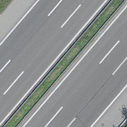
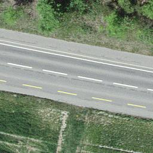
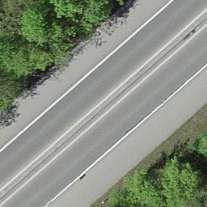
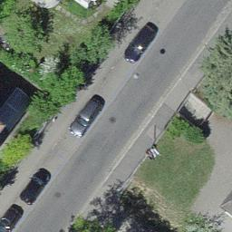

# imagination

This repository aims at extracting `lane count` / `road types` features from aerial imagery in switzerland. It emerged from an idea for the [Geo.Hackmin Week](https://cividi.ch/geohackmin/). 

AI based feature extraction from aerial imagery has shown promising results in several studies for road features (eg [Mnhi](https://www.cs.toronto.edu/~vmnih/docs/Mnih_Volodymyr_PhD_Thesis.pdf)) . Various implementations are available like for example [roadtagger](https://github.com/mitroadmaps/roadtagger) or [airs](https://github.com/mahmoudmohsen213/airs). There is also a comprehensive collection of resources on [deep learning using satelite imagery](https://github.com/robmarkcole/satellite-image-deep-learning) on github.

## Dataset

The [swissimage](https://shop.swisstopo.admin.ch/en/products/images/ortho_images/SWISSIMAGE10) dataset consists of cloud free areal imagery with a ground resolution of 10 centimeters. From this more than 60k road images were extracted for training.

     

  

## Classify road types

There exist various [road type calssifications](https://de.wikipedia.org/wiki/Strassensystem_in_der_Schweiz_und_in_Liechtenstein#Schweiz_2) in switzerland which we may try to fit. We explored two models, a [basic cnn](main_cnn.py) calssifier and a [customized DenseNet](main_dense.py) that fit the `objektart` of the street layer of the [swissTLM3D](https://www.swisstopo.admin.ch/de/geodata/landscape/tlm3d.html).

### Unsupervised way

In case there is no labels in the dataset, to find out the road type, we can manually crop images of different types of roads and use these images as reference. Then we can compute the perceptual loss between the image and the reference. The smallest loss yields the type/class of the input image. Perceptual loss can be easily computed by the pretrained model [VGG16](https://www.tensorflow.org/api_docs/python/tf/keras/applications/VGG16). Unlike pixel-wise loss such as L2 loss, perceptual loss focuses on the content of the image, hence is more tolerant to translation and rotation of the objects.

## Count lanes

To count the marks or edges of road lanes, edge detection might be efficient. If the backgrounds/surroundings are noisy, we can use bileteral filter to preprocess the image.

## License

imagination is released under [The Anti-Capitalist Software License (version 1.4)](https://anticapitalist.software/).
